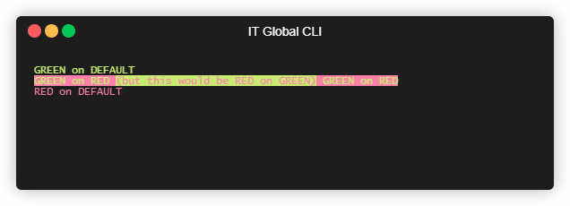

# Core features

[Go back](..#home)

---

`ITGlobal.CLI`'s core features are located in [`ITGlobal.CLI.Terminal`](https://www.nuget.org/packages/ITGlobal.CLI.Terminal/) Nuget package
and provide the following abilities:

* [Colored console output](#colors)
* [Ctrl+C/SIGINT interceptor](#ctrl-c)
* [Unified error handling](#errors)
* [No-Colors mode](#no-colors)

## Initialization {#init}

Before you may use any of `ITGlobal.CLI`'s features, you need to initialize terminal driver:

```csharp
Terminal.Initialize();
```

You may call this method multiple times, it will run initialization only one anyway.

## Colored console output {#colors}

`ITGlobal.CLI` provides (and uses internally) a unified wrapper for standart input, output and error streams - an `AnsiString` struct.
This is basically an array for characters combined with color attributes.

Under the hood `ITGlobal.CLI` uses ANSI escape codes for colorization.
Also it contains a driver to properly handle ANSI color codes while running on Windows.
However, only color codes are supported, full ANSI support is not available.

Converting an `AnsiString` into a string (via standard `ToString()` method) will result in colored ANSI string
that may be consumed by an ANSI compatible terminal.

### Creating colored strings

`AnsiString` offers few ways to to create and manage it:

* explicit type convertion from a string:

  ```csharp
  var ansiStr = (AnsiString)"foo bar";
  ```

* `AnsiString.Create()` method:

  ```csharp
  var ansiStr = AnsiString.Create("foo bar");
  ```

* `+` operator for concatenation:

  ```csharp
  var ansiStr1 = AnsiString.Create("foo");
  var ansiStr2 = AnsiString.Create("bar");
  var ansiStr3 = ansiStr1 + " " + ansiStr2;
  ```

* `AnsiString.Concat()` method:

  ```csharp
  var ansiStr1 = AnsiString.Create("foo");
  ansiStr1 = ansiStr1.Concat((AnsiString)" ");
  var ansiStr2 = AnsiString.Create("bar");
  var ansiStr3 = ansiStr1.Concat(ansiStr2);
  ```

* `string.Format` and interpolated strings

  ```csharp
   var ansiStr1 = AnsiString.Create("foo");
   var ansiStr2 = AnsiString.Create("bar");
   var ansiStr3 = AnsiString.Create($"{ansiStr1} {ansiStr2}");
  ```

* A set of extension methods for both `string` and `AnsiString`:

  ```csharp
  // This would create a "foo" string with red foreground and default background
  var ansiStr1 = "foo".Red();

  // This would change background color to white (red foreground won't change)
  ansiStr1 = ansiStr1.OnWhite();

  // This would create a "bar" string with default foreground and blue background
  var background = ConsoleColor.Blue;
  var ansiStr2 = "foo".Bg(background);

  // This would change foreground color to green (blue background won't change)
  var foreground = ConsoleColor.Green;
  ansiStr2 = ansiStr2.Fg(foreground);
  ```

  The following extension methods are available:

  * `Fg(foregroundColor)` - sets foreground color
  * `Bg(backgroundColor)` - sets background color
  * `Colored(foregroundColor = default, backgroundColor = default)` - sets both foreground and background colors
  * `%ColorName%()` (e.g. `Red()`) - sets foreground color to `%ColorName%`
  * `On%ColorName%()` (e.g. `OnWhite()`) - sets background color to `%ColorName%`
  * `%ColorNameFg%On%ColorNameBg%()` (e.g. `RedOnWhite()`) - sets foreground color to `%ColorNameFg%`
    background color to `%ColorNameBg%`

### Printing colored strings

Once created, an `AnsiString` may be printed to a console using default `System.Console` class:

```csharp
Terminal.Initialize();

Console.WriteLine("GREEN on DEFAULT".Green());
Console.WriteLine($"GREEN on RED {"(but this would be RED on GREEN)".RedOnGreen()} GREEN on RED".GreenOnRed());
Console.WriteLine("RED on DEFAULT".Red());
```

Here's an output of this code sample:



## Ctrl+C/SIGINT interceptor {#ctrl-c}

You can easily intercept a `Ctrl-C`/`SIGINT` event and convert it into a `CancellationToken`:

```csharp
using(var ctrlC = Terminal.OnCtrlC())
{
    CancellationToken token = ctrlC.CancellationToken;

    token.Register(() => Console.WriteLine("This is a callback on a CancellationToken"));

    Console.WriteLine("Press Ctrl+C to exit...");
    token.WaitHandle.WaitOne();
    Console.WriteLine("Cancelled!");
}
```


## Unified error handling {#errors}

`ITGlobal CLI` offers an easy way to pretty-print exceptions in a command line application:

```csharp
TerminalErrorHandler.Handle(() =>
{
    throw new Exception("This exception will be pretty-printed to console");
});
```


Note that `CommandLineException`s are handled differently, allowing you to create a nice error message:

```csharp
TerminalErrorHandler.Handle(() =>
{
    throw new CommandLineException(
        "You have done something wrong, please read the manual and correct youself."
    );
});
```


Async functions are supported too:

```csharp
await TerminalErrorHandler.HandleAsync(async () =>
{
    await Task.Delay(100);
    throw new Exception("This exception will be pretty-printed to console");
});
```

## No-Colors mode {#no-colors}

`ITGlobal.CLI` allows you to (temporarily) disable console output colorization.
This might come in handy when you need to keep your console output clean of ANSI escape sequences.

```csharp
Console.WriteLine("This text will be printed in color".Green());

using (Terminal.DisableColors())
{
    Console.WriteLine("This text will be printed in black and white".Green());
}

Console.WriteLine("This text will be printed in color".Green());
```


