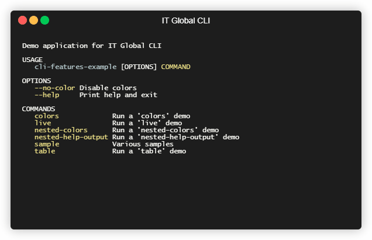
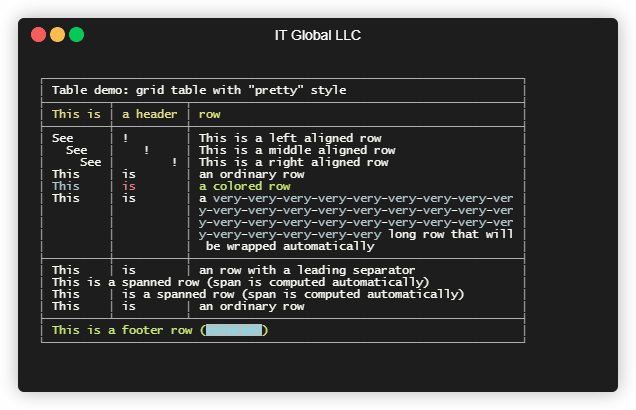
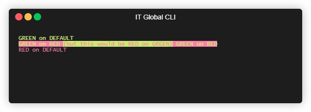

# CLI - Command Line Interface library

[](https://ci.appveyor.com/project/itgloballlc/cli/branch/master)
[](https://www.nuget.org/packages/ITGlobal.CLI/)

`ITGlobal.CLI` is a powerful library to build used-friendly command-line applications.

<div style="display: flex; flex-flow: row;">
  <div style="width: 50%; display: flex; flex-flow: column;">
    
  </div>
  <div style="width: 50%; display: flex; flex-flow: column;">
    
  </div>
</div>

## Features

### Cross-platform

`ITGlobal CLI` supports:

* .NET 4.5
* .NET Core (`netstandard2.0`)

It runs on Windows, Linux or MacOS.

### [Core features](core)



* [Colored console output](core#colored-console-output)
* [Ctrl+C/SIGINT interceptor](core#ctrlcsigint-interceptor)
* [Unified error handling](core#unified-error-handling)
* [No-Colors mode](core#no-colors-mode)

### [Command line parser](parser)


* [Switches](parser/switches)
* [Options](parser/options)
* [Positional arguments](parser/arguments)  
* [Commands (including nested commands)](parser/commands)
* [Value parsers](parser/values)
* [Built-in help](parser/help)
* [Parser configuration options](parser/config)

### [ASCII tables](table)


* [Data-driven tables](table/data-driven)
* [Free-format (fluent) tables](table/fluent)

### [Terminal live output](live)


* [Live text](live#live-text)
* [Spinner](live#spinner)
* [Progress bar](live#progress-bar)

## Installing

All you need is to install a [`ITGlobal.CLI`](https://www.nuget.org/packages/ITGlobal.CLI/) NuGet package into your project:

### Using dotnet CLI

```shell
dotnet add package ITGlobal.CLI
```

### Using Package Manager Console in Visual Studio

```shell
Install-Package ITGlobal.CLI
```

### Manually in .csproj file

```xml
<Project Sdk="Microsoft.NET.Sdk">

  <!-- ... -->

  <ItemGroup>
    <PackageReference Include="ITGlobal.CLI" Version="3.0.29" />
  </ItemGroup>

  <!-- ... -->
</Project>
```
