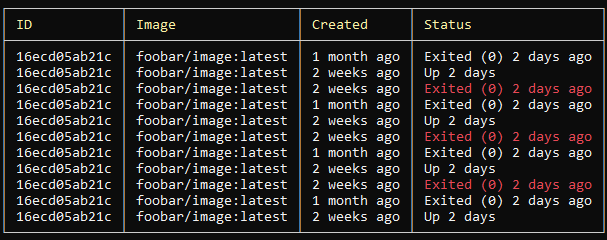

# CLI - Command Line Interface library

[](https://ci.appveyor.com/project/itgloballlc/cli/branch/master)
[](https://www.nuget.org/packages/ITGlobal.CLI/)

`ITGlobal.CLI` is a powerful library to build used-friendly command-line applications.

## Features

### Cross-platform

`ITGlobal CLI` supports:

* .NET 4.0
* .NET Core (`netstandard2.0`)

It runs on Windows, Linux or MacOS.

### [Command line parser](parser)

Unlike most command line parsers for .NET, `ITGlobal CLI Parser` uses fluent interface to define command line parameters and commands.
An example below shows a fast implementation of `git pull` and `git push` commands:

```csharp
// Define a command line parser
var dotnet = CliParser.NewTreeParser().ExecutableName("dotnet").HelpText("git wannabe");

// Define a global '-v|--version' switch
var versionSwitch = dotnet.Switch('v', "version").HelpText("Print version and exit");

// Define a 'restore' command
var restoreCommand = dotnet.Command("restore").HelpText("Restore project dependencies");

// Define an argument specific to 'restore' command
var projectParameter = restoreCommand.Argument<string>("PROJECT");

// Define a switch specific for 'restore' command
var forceSwitch = restoreCommand.Switch('f', "force").HelpText("Restore dependencies forcibly");

restoreCommand.OnExecute(context =>
{
    // This code will be called when a 'restore' command is invoked
});

// Parse command line and execute command
dotnet.Parse(args).Run();
```

Parser supports:

* switches
* named options
* positional arguments
* commands, including nested commands
* custom value parsers for options/arguments
* aliases for switches, options, arguments an commands
* both global and command-scoped switches and options
* value validation
* default values

> [**Read more**](parser)

### [Easy color management](colors)

```csharp
// First, initialize terminal services
Terminal.Initialize();

// Then use extension methods to colorize output:
Console.WriteLine("This text will be written in RED font on default background".Red());
Console.WriteLine($"This text will be written in {"WHITE".WhiteOnRed()} font on RED background");

ConsoleColor color = ConsoleColor.Green;
Console.WriteLine("This text will be colorized with an external parameter".Fg(color));

// Or alternatively a ColoredString might be created manually
ColoredString str = new ColoredString("Text", ConsoleColor.Green, ConsoleColor.Red);
Console.WriteLine($"Output: {str}");
```

> [**Read more**](colors)

### Graceful Ctrl+C/SIGINT handlers

You can easily intercept a `Ctrl-C`/`SIGINT` event and convert it into a `CancellationToken`:

```csharp
using(var ctrlC = Terminal.OnCtrlC())
{
    CancellationToken token = ctrlC.CancellationToken;

    token.Register(() => Console.WriteLine("This is a callback on a CancellationToken"));

    Console.WriteLine("Press Ctrl+C to exit...");
    token.WaitHandle.WaitOne();
    Console.WriteLine("Cancelled!");
}
```

### Unified error handling

`ITGlobal CLI` offers an easy way to pretty-print exceptions in a command line application:

```csharp
TerminalErrorHandler.Handle(() =>
{
    throw new Exception("This exception will be pretty-printed to console");
});
```

Even for async functions!

```csharp
await TerminalErrorHandler.HandleAsync(async () =>
{
    await Task.Delay(100);
    throw new Exception("This exception will be pretty-printed to console");
});
```

### [Live output](live-output)

`ITGlobal CLI` contains a "live output" feature, which allows you to create:

* spinners,
* lines of text,
* progress bars

and to update them in-place.

See example below:

```csharp
// Progress bar
using (var liveOutput = LiveOutputManager.Create())
{
    var progressBar = liveOutput.CreateProgressBar("1/3...");
    Thread.Sleep(1000);
    progressBar.Write(33, "2/3...");
    Thread.Sleep(1000);
    progressBar.Write(66, "3/3...");
    Thread.Sleep(1000);
    progressBar.Complete("3/3 done");
}

// Line of text
using (var liveOutput = LiveOutputManager.Create())
{
    var text = liveOutput.CreateText("1/3...");
    Thread.Sleep(1000);
    text.Write("2/3...");
    Thread.Sleep(1000);
    text.Complete("3/3 done");
}

// Spinner
using (var liveOutput = LiveOutputManager.Create())
{
    var spinner = liveOutput.CreateSpinner("Downloading...");
    // Update a spinner label
    spinner.Write("Starting long operation");

    // Run a BLOCKING operation
    // Spinner animation will not freeze during this call
    LongBlockingOperation1();

    // Print various text into console and spinner will handle this properly
    Console.WriteLine("A line of text");
}
```

`LiveOutputManager` proprely handles console output, e.g. you can write log messages to console
and this won't mess with your progress bars and spinners.

> [**Read more**](live-output)

### [Formatted tables](tables)



`ITGlobal CLI` provides a way to print pretty formatted tables into console:

#### [Strongly-typed data-driven tables](tables/data-driven)

```csharp
// Create a table builder (attached to source data)
var data = GetMyDataArray();
var table = TerminalTable.Create(data);

// Define table columns

// A plain column
table.Column("Header 1", _ => _.Property1);
// A RED column
table.Column("Header 2", _ => _.Property2, _ => ConsoleColor.Red);
// A multi-colored column
table.Column("Header 2", _ => _.Property2, row => GetColorForRow(row)));
// A trimmed column
table.Column("Header 3", _ => _.Property1, maxWidth: 24);

// Draw table
table.Draw();
```

#### [Free-format tables](tables/fluent)

```csharp
// Create a table builder
var table = TerminalTable.CreateFluent(renderer);

// Add a "table title" row
table.Title(title);

// Add a "table column headers" row
table.Headers("This is", "a header", "row");

// Add few "table body" rows
table.Add("This", "is a", "data row");
table.Add("This", "is a", "colored data row".Cyan());
table.Add("This", "is an", "aligned data row".Cyan());

// Add a separator
table.Separator();

// Add few more "table body" rows
table.Add(_ => _.AddLeftAlign("See").AddLeftAlign("!").Add("This is a left aligned row"));
table.Add(_ => _.AddMiddleAlign("See").AddMiddleAlign("!").Add("This is a middle aligned row"));
table.Add(_ => _.AddRightAlign("See").AddRightAlign("!").Add("This is a right aligned row"));

// Add a "table footer" row
table.Footer("This is a footer row (colored!)".Green());

// Draw table
table.Draw();
```

`ITGlobal CLI` tables suppport:

* Configurable table headers
* Per-cell colorization
* Few rendering styles: `pretty`, `sketch`, `pipe` and `simple`.
