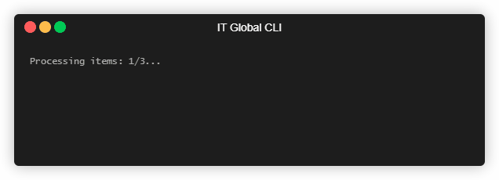
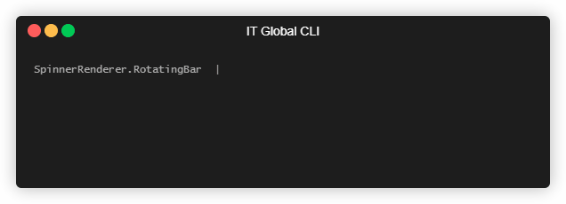
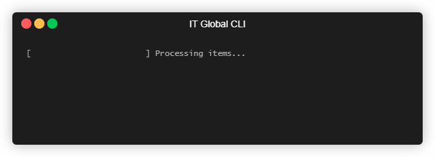

# Terminal live output

[Go back](..)

---

* [Quickstart](#quickstart)
* [Feature details](#feature-details)
* [Live text](#live-text)
* [Spinner](#spinner)
* [Progress bar](#progress-bar)

`ITGlobal CLI` contains a "live output" feature, which allows you to create:

* lines of text,
* spinners,
* progress bars

and to update them in-place.

## Quickstart

1. At first you need to create an instance of `ILiveOutputManager`.
   This object is responsible for creating and maitaining all live items.

   ```csharp
   var liveOutput = LiveOutputManager.Create();
   ```

   `LiveOutputManager.Create()` method has parameters to override rendering
   of spinners and progress bar:

   ```csharp
   var spinnerRenderer = SpinnerRenderer.BouncingBall();
   var progressBarRenderer = ProgressBarRenderer.Arrow();

   var liveOutput = LiveOutputManager.Create(
       spinnerRenderer: spinnerRenderer,
       progressBarRenderer: progressBarRenderer
   );
   ```

2. Then you may create all live output items you need:

   ```csharp
   var text = liveOutput.CreateText("An updatable text");
   var spinner = liveOutput.CreateSpinner("A spinner");
   var progressBar = liveOutput.CreateProgressBar("A progress bar");
   ```

   Note that you may create new items when you need.
   It's not necessary to create all of them right after creation of `ILiveOutputManager`.

3. Then you may update live output items as (and when) you need to"

   ```csharp
   text.Write("This text has been updated");
   spinner.Write("Still spinning");
   progressBar.Write(33, "In progress...");
   ```

   All live output objects are thread-safe and can be updated from another thread.

   While a live output is on, you still may write anything to console using standard `System.Console` class.
   This will not break live output behaviour since ILiveOutputManager` handles conflicting
   output gracefully.

4. When you don't need live output items anymore, you may destroy all of them by dispoing an `ILiveOutputManager`:

   ```csharp
   liveOutput.Dispose();
   ```

   It's strongly recommended to use `using()` or `try-finally` operators.

## Feature details

### Live text

Live text is a most simple live output item - it's just a line of colored text
that can be updated in place.

A live output text is created using a `CreateText()` method of `ILiveOutputManager`.
It provides the following method to update it:

* `Write()` method updates text.
* `WipeAfter()` method enables or disabled a "wipe-after" mode.

  If it's enabled, a line of text will be cleared from screen then `ILiveOutputManager` is disposed.
  Otherwise it will stay on screen in its latest state.

  By default this mode is disabled.

```csharp
using (var liveOutput = LiveOutputManager.Create())
{
    var text = liveOutput.CreateText("Processing items: 1/3...");
    text.WipeAfter();
    Thread.Sleep(1000);
    text.Write("Processing items: 2/3...");
    Thread.Sleep(1000);
    text.Write("Processing items: 3/3...");
    Thread.Sleep(1000);
}

Console.WriteLine("Processing is completed");
```



## Spinner

Spinner is a more complicated version of live text item - it's a line of colored text
that can be updated in place plus an animated spinner.

A spinner is created using a `CreateSpinner()` method of `ILiveOutputManager`.
It provides the following method to update it:

* `Write()` method updates text.
* `WipeAfter()` method enables or disabled a "wipe-after" mode.

  If it's enabled, a line of text will be cleared from screen then `ILiveOutputManager` is disposed.
  Otherwise it will stay on screen in its latest state.

  By default this mode is disabled.

```csharp
using (var liveOutput = LiveOutputManager.Create())
{
    var spinner = liveOutput.CreateSpinner("Processing items: 1/3...");
    spinner.WipeAfter();
    Thread.Sleep(1000);
    spinner.Write("Processing items: 2/3...");
    Thread.Sleep(1000);
    spinner.Write("Processing items: 3/3...");
    Thread.Sleep(1000);
}

Console.WriteLine("Processing is completed");
```


Spinner rendering is configured via `SpinnerRenderer` which is passed to `LiveOutputManager.Create()` method.

By default a `SpinnerRenderer.Default` renderer is used, which is a `RotatingBar` renderer unless overriden.
The following built-in spinner renderers are available:

* `SpinnerRenderer.RotatingBar()`
* `SpinnerRenderer.RotatingAngle()`
* `SpinnerRenderer.Arrow()`
* `SpinnerRenderer.BouncingBall()`

All of them are configurable - you may override:

* spinner colors
* spinner location (at the end of line or in beginning of it)
* a whitespace between spinner and text



## Progress bar

Progress bar is a line of colored text that can be updated in place plus a bar that displays progress.

A progress bar is created using a `CreateProgressBar()` method of `ILiveOutputManager`.
It provides the following method to update it:

* `Write()` method updates text and/or progress value.

  Progress value should lie in range from 0 to 100, where 0 means an empty bar
  and 100 means a full bar.

* `WipeAfter()` method enables or disabled a "wipe-after" mode.

  If it's enabled, a line of text will be cleared from screen then `ILiveOutputManager` is disposed.
  Otherwise it will stay on screen in its latest state.

  By default this mode is disabled.

* `Complete()` method updates text and disabled bar rendering, only text will be rendered.

  This might come in handy when you have few simultaneous operations
  and you need to display that some of operations are fully completed.

```csharp
using (var liveOutput = LiveOutputManager.Create())
{
    var progressBar = liveOutput.CreateProgressBar("Processing items...");
    progressBar.WipeAfter();
    for (var i = 0; i < 100; i += 10)
    {
        progressBar.Write(i);
        Thread.Sleep(500);
    }
}

Console.WriteLine("Processing is completed");
```



Progress bar rendering is configured via `ProgressBarRenderer` which is passed to `LiveOutputManager.Create()` method.

By default a `ProgressBarRenderer.Default` renderer is used, which is a `Arrow` renderer unless overriden.
The following built-in progress bar renderers are available:

* `ProgressBarRenderer.Arrow()`
* `ProgressBarRenderer.HashSign()`
* `ProgressBarRenderer.Legacy()`
* `ProgressBarRenderer.Shades()`

All of them are configurable - you may override:

* progress bar colors
* progress bar location (at the end of line or in beginning of it)
* progress bar size
* a whitespace between spinner and text


