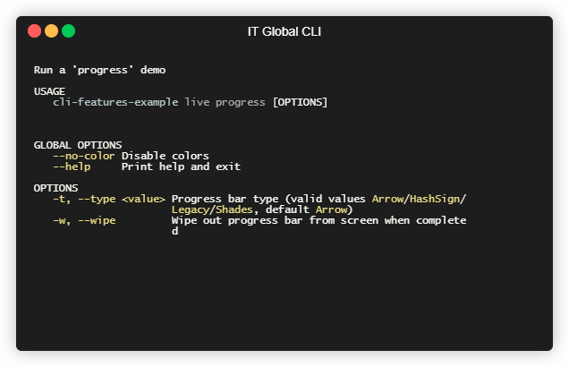
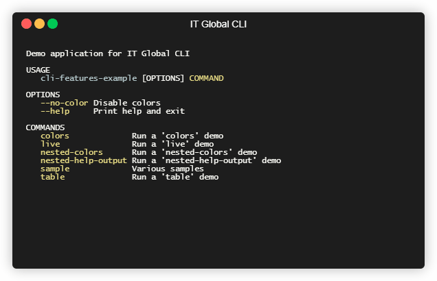

# Built-in help

[Go back](../parser#home)

---

* [Using an auto-generated help ](#usage)
* [Programmatic usage access ](#programmatic)
* [Disabling built-in help ](#disable)

`ITGlobal.CLI` command line parser contains a built-in support for auto-generated help.

## Using an auto-generated help {#usage}

Parser supports two ways to display auto-generated help:

* **Using a `-h` or `--help` switch**

  Append a `-h` or a `--help` to a command line to display help an exit.
  If a command is specified - a help on this command will be printed.
  Otherwise a generic help will be displayed.

  So, you should type `my-app --help` to get help on root command and global options.

  

  Typing `my-app my command name --help` will give you a help on specific command.

  

* **Using an implicit help**

  If you're using a `CliParser.NewTreeParser()` and you run your application
  without any command line arguments, an implicit help on root commands will be displayed

  

## Programmatic usage access {#programmatic}

Parser provides a programmatic access to auto-generated help:

```csharp
var parser = CliParser.NewTreeParser();

// TODO Configure commands and options...
var command = parser.Command("command");

// Get a root usage from parser
var rootUsage = parser.GetUsage();

// Get a command-specific usage from a command
var commandUsage = command.GetUsage();
```

You may use this data for various purposes, e.g. auto generating MAN pages or text manuals.

## Disabling built-in help {#disable}

In some cases you might need to opt-out built-in help feature.

* To disable `-h` and `--help` switches:

  Set `CliParser.NewTreeParser()`/`CliParser.NewSimpleParser()`'s `disableHelpSwitch` method parameter to `true`:

  ```csharp
  var parser = CliParser.NewTreeParser(disableHelpSwitch: true);
  // or
  var parser = CliParser.NewSimpleParser(disableHelpSwitch: true);
  ```

  This will prevent parser from adding `-h`/`--help` switches and their hooks.

* To disable implicit help:

  Set `CliParser.NewTreeParser()`'s `disableImplicitHelp` method parameter to `true`:

  ```csharp
  var parser = CliParser.NewTreeParser(disableImplicitHelp: true);
  ```

  This will prevent parser from adding default `OnExecute` callback, allowing you to set your own one.
  
  Note that implicit help is avaiable for `CliParser.NewTreeParser()` only.
