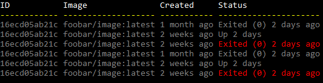
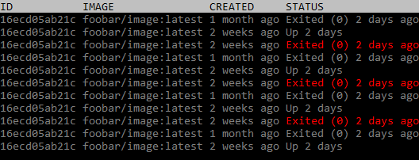
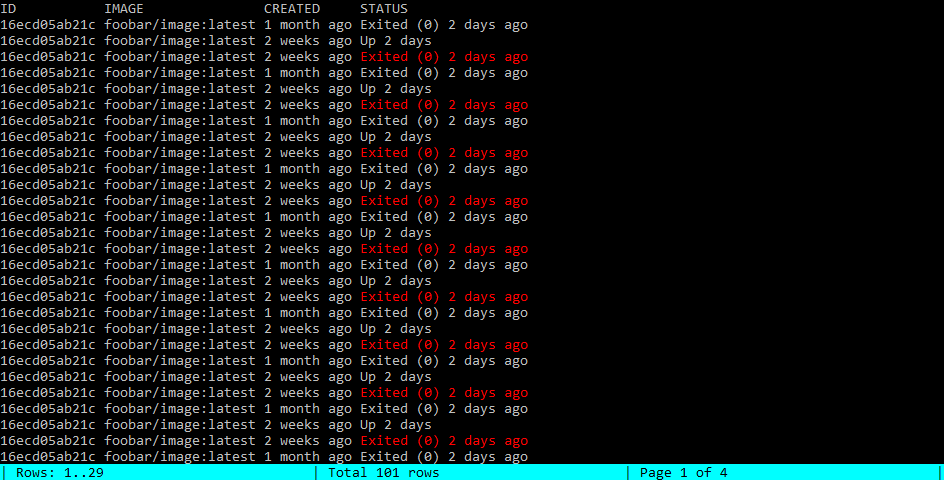

# Table printer

## Usage

```csharp
// Prepare data for table
var data = new List<TableRow>();
for (var x = 0; x <= n; x++)
{
    data.Add(new TableRow(
        id: "16ecd05ab21c",
        image: "foobar/image:latest",
        created: x % 3==0?"1 month ago": "2 weeks ago",
        status: x % 3 == 1 ? "Up 2 days" : "Exited (0) 2 days ago",
        isRunning: x % 3 == 2
    ));
}

// Create a table builder
var table = TerminalTable.Create(data);

// Setup columns
// You may alter each cell's foreground and background colors
table.Column("ID", _ => _.Id);
table.Column("Image", _ => _.Image);
table.Column("Created", _ => _.Created);
table.Column(
  "Status",
  _ => _.Status,
  fg: _ => _.IsRunning ? ConsoleColor.Red : (ConsoleColor?) null
);

// Draw table to a terminal
table.Draw();
```

And that's what you will get:


## Customized rendering

You may alter table rendering algorithm using `renderer` parameter of `TerminalTable.Create<T>()` method:

```csharp
var table = TerminalTable.Create(
    data,
    TableRenderer.Plain(
        uppercaseHeaders: false,
        underlineHeaders: true,
        headerForegroundColor: ConsoleColor.White,
        headerUnderlineForegroundColor: ConsoleColor.Yellow,
        defaultForegroundColor: ConsoleColor.DarkGray
    )
);
```



```csharp
var table = TerminalTable.Create(
    data,
    TableRenderer.Plain(
        uppercaseHeaders: true,
        underlineHeaders: false,
        headerForegroundColor: ConsoleColor.Black,
        headerBackgroundColor: ConsoleColor.Gray,
        headerUnderlineForegroundColor: ConsoleColor.Yellow,
        defaultForegroundColor: ConsoleColor.DarkGray
    )
);
```



## Interactive scrolling

Use `TableRenderer.Paged()` to create an interactive table that supports scrolling with keyboard keys:\

```csharp
var table = TerminalTable.Create(data, TableRenderer.Paged());
```



Use the following keys to navigate through table rows:

* `Q`, `ESC` - exit
* `PageUp` - scroll one screen up
* `PageDown`,`Space`, `Enter` - scroll one screen down
* `Home` - scroll to first screen
* `End` - scroll to last screen
* `UpArrow` - scroll one line up
* `DownArrow` - scroll one line down

> Please note that interactive mode will be disabled automatically if standard output stream is redirected
