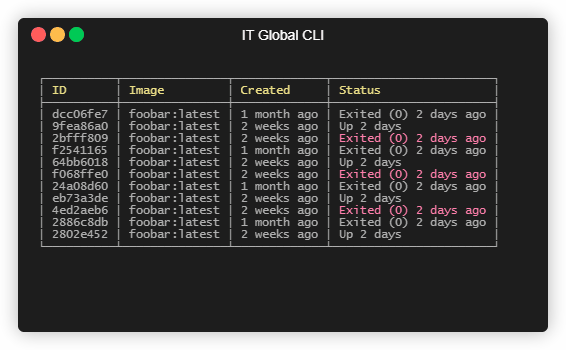

# Data-driven tables

[Go back](../table)

---

* [Quickstart](#quickstart)
* [Column parameters](#column-parameters)
* [Table parameters](#table-parameters)

`ITGlobal CLI` offers a way to generate a pretty-formatted tables from a list of objects.

## Quickstart

1. First, prepare source data:

   ```csharp
   var list = new List<TableRow>();
   // TableRow here is a custom type

   // TODO fill list with table source data
   ```

2. Then create a strongly-typed table builder:

   ```csharp
   // Create and configure table renderer
   var renderer = TableRenderer.Grid(GridTableStyle.Pretty());

   // Then create a table builder attached to source data and renderer
   var table = TerminalTable.Create(list, renderer);
   // or alternatively create a table builder with default renderer
   var table = TerminalTable.Create(list);
   ```

3. Define table columns:

   ```csharp
   table.Column("ID", _ => _.Id, align: _ => TableCellAlignment.Left);
   table.Column("Image", _ => _.Image);
   table.Column("Created", _ => _.Created);
   table.Column("Status", _ => _.Status, style: _ => _.IsRunning ? ColoredStringStyle.Red : null);
   ```

4. And finally render table to console:

   ```csharp
   table.Draw();
   ```

   

## Column parameters

For every column you you may define the following parameters:

* `title` - header text.
  This is a required parameter.
* `property` - body cell text as a function that maps a data item to a table row cell.
  This is a required parameter.
* `style` - body cell text style as a function that maps a data item to a table row cell's text style.
  This is an optional parameter.
* `align` - body cell text alignment as a function that maps a data item to a table row cell's text alignment.
  This is an optional parameter.

Note that both header text and body cell text are `AnsiString`s, not an ordinary string.
Thus you may use any custom colorization in them.

## Table parameters

There are few method to define table-wide parameters:

* `Align()` method defines a default function to evaluate table cell text alignment.
* `Style()` method defines a default function to evaluate table cell text style.
* `Foreground()` method defines a default function to evaluate table cell text foreground color.
* `Background()` method defines a default function to evaluate table cell text background color.
* `Title()` methods sets a table title. By default table will have no title.
* `Footer()` methods sets a table footer. By default table will have no footer.
