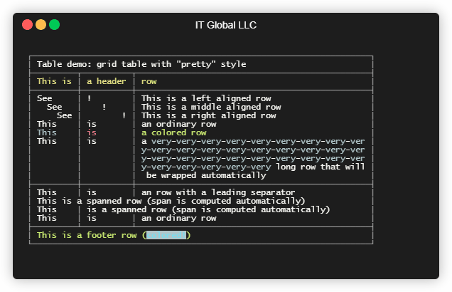

# Free-format (fluent) tables

[Go back](../table#home)

---

`ITGlobal CLI` offers a way to generate a pretty-formatted tables by defining rows manually.

1. First, create a strongly-typed table builder:

   ```csharp
   // Create and configure table renderer
   var renderer = TableRenderer.Grid(GridTableStyle.Pretty());
   // Then create a table builder attached renderer
   var table = TerminalTable.CreateFluent(renderer);

   // or alternatively create a table builder with default renderer
   var table = TerminalTable.CreateFluent();
   ```

2. Then add table rows. There are few supported row types:

   * **Table title row**:

     ```csharp
     table.Title("Table demo: grid table with \"pretty\" style");
     ```

   * **Table column headers row**:

     ```csharp
     table.Headers("This is", "a header", "row");
     ```

   * **Table body row**:

     ```csharp
     table.Add("This", "is", "an ordinary row");

     // You can add per-cell colors
     table.Add("This".Cyan(), "is".Red(), "a colored row".Green());

     // And per-cell alignment
     table.Add(_ => _.AddRightAlign("See").AddRightAlign("!").Add("This is a right aligned row"));

     // If a row has less cells compared to other rows
     // then a column span will be added automatically
     table.Add("This is an ordinary row");

     // If a cell contains very long text, it will be wrapped automatically
     table.Add("This", "is", $"a {string.Join("-", Enumerable.Repeat("very", 32))} long row that will be wrapped automatically");
     ```

   * **Table separator row**:

      ```csharp
      table.Separator();
      ```
 
   * **Table footer row**:

     ```csharp
     table.Footer("This is a footer row (colored!)".Green());
     ```

3. And finally render table to console:

   ```csharp
   table.Draw();
   ```

   
