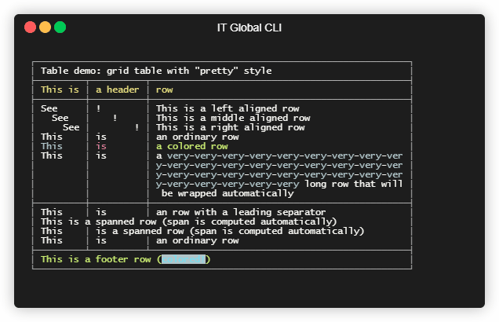
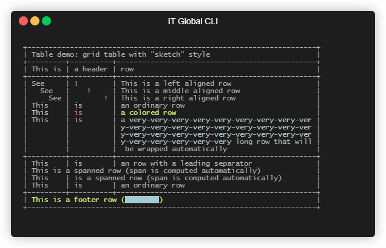
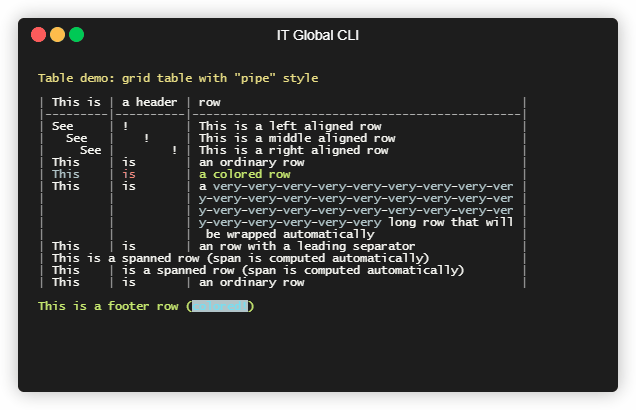
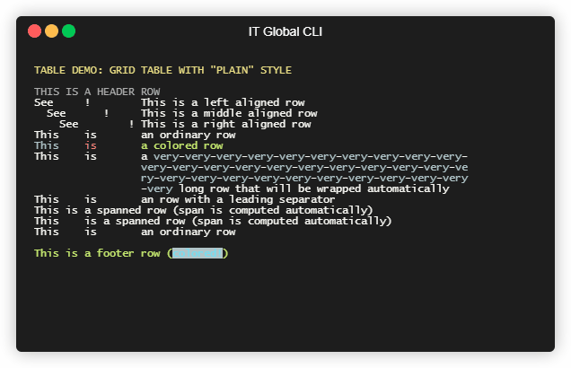

# ASCII tables

[Go back](..)

---

`ITGlobal CLI` provides a handy way to render ASCII tables.
There are to ways to define table data:

* [Data-driven tables](data-driven)
* [Free-format (fluent) tables](fluent)

Table generator is also used internally in [command line parser](../parser) to produce help output.

## Output

By default table builders renders table output to standard output.
However, there are few helpers to customize output:

* Add a `maxWidth` parameter to `Draw()` method to override table max allowed width:
  
  ```csharp
  table.Draw(maxWidth: 120);
  ```

* Use an overload of `Draw()` method to render a table to a `TextWriter`:

  ```csharp
  TextWriter writer = CreateTextWriter();
  table.Draw(writer);
  ```

* Use an overload of `Draw()` method to render a table to a `StringBuilder`:

  ```csharp
  StringBuilder stringBuilder = new StringBuilder();
  table.Draw(stringBuilder);
  ```

* Use an overload of `Draw()` method to render a table to a custom callback:

  ```csharp
  Action<string> callback = str => Console.WriteLine(str);
  table.Draw(callback);
  ```

* Use a `DrawToString()` method to render a table to a string:

  ```csharp
  string output = table.DrawToString();
  ```

## Customized rendering

Table rendering is configured via `TableRenderer` which is passed
to `TerminalTable.Create<T>()`/`TerminalTable.CreateFluent()` methods.

By default a `TableRenderer.Default` renderer is used,
which is a `Grid` renderer with `Sketch` style unless overriden.
The following built-in table renderers are available:

* `TableRenderer.Grid()`
* `TableRenderer.Pipe()`
* `TableRenderer.Plain()`

### Grid table renderer

Grid-style table renderer is enabled by default and is designed to render a table with preudographic characters.
It supports two rendering styles:

* **Pretty**:

  ```csharp
  var renderer = TableRenderer.Grid(GridTableStyle.Pretty());
  ```
  
  

  Note than `GridTableStyle.Pretty()` method has optional parameter to override table colors.

* **Sketch**:

  ```csharp
  var renderer = TableRenderer.Grid(GridTableStyle.Sketch());
  ```
  
  

### Pipe table renderer

Pipe-style table renderer is designed to render a table using a markdown-style formatting.

```csharp
var renderer = TableRenderer.Pipe();
```
  


### Plain table renderer

Plain table renderer is designed to render a table using a simpliest formatting possible.
This renderer provides most compact output.

```csharp
var renderer = TableRenderer.Plain();
```
  

