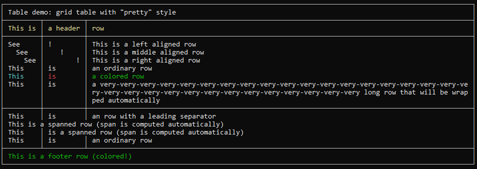

# Free-format (fluent) tables

> [CLI](../..) / [Tables](../tables) / Free-format

`ITGlobal CLI` offers a way to generate a pretty-formatted tables by defining rows manually.

First, create a strongly-typed table builder:

```csharp
// Create and configure table renderer
var renderer = TableRenderer.Grid(GridTableStyle.Pretty());
// Then create a table builder attached renderer
var table = TerminalTable.CreateFluent(renderer);

// or alternatively create a table builder with default renderer
var table = TerminalTable.CreateFluent();
```

Then add table rows. There are few supported row types:

* **Table title row**:
  
  ```csharp
  table.Title("Table demo: grid table with \"pretty\" style");
  ```

* **Table column headers row**:

  ```csharp
  table.Headers("This is", "a header", "row");
  ```

* **Table body row**:

  ```csharp
  table.Add("This", "is", "an ordinary row");
  // You can add per-cell colors
  table.Add("This".Cyan(), "is".Red(), "a colored row".Green());
  // And per-cell alignment
  table.Add(_ => _.AddRightAlign("See").AddRightAlign("!").Add("This is a right aligned row"));
  // If a row has less cells compared to other rows
  // then a column span will be added automatically
  table.Add("This is an ordinary row");
  // If a cell contains very long text, it will be wrapped automatically
  table.Add("This", "is", $"a {string.Join("-", Enumerable.Repeat("very", 32))} long row that will be wrapped automatically");
  ```

* **Table separator row**:

   ```csharp
   table.Separator();
   ```

* **Table footer row**:

  ```csharp
  table.Footer("This is a footer row (colored!)".Green());
  ```

And finally render table to console:

```csharp
table.Draw();
```

